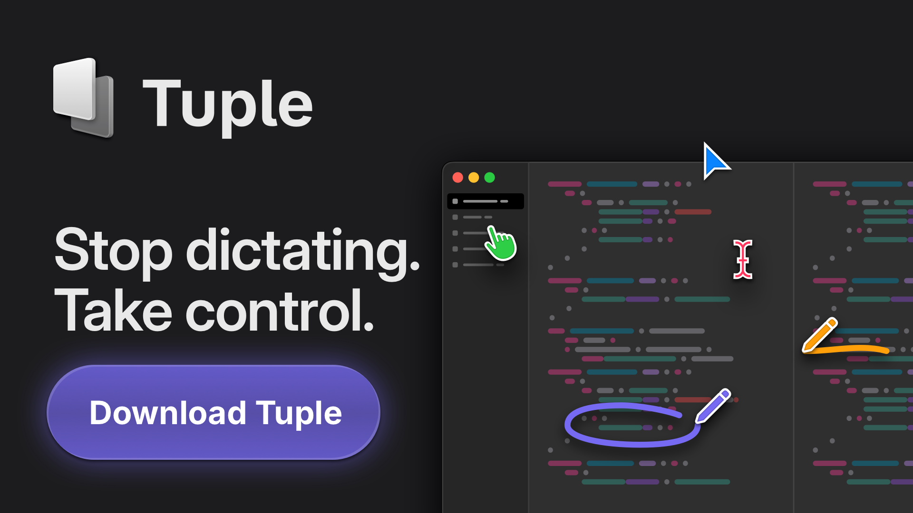

<div align="center">
  <a href="https://dokploy.com">
    
  </a>
  </br>
  </br>
  <p>Join us on Discord for help, feedback, and discussions!</p>
  <a href="https://discord.gg/2tBnJ3jDJc">
    
  </a>
</div>
<br />


<div align="center" markdown="1">
   <sup>Special thanks to:</sup>
   <br>
   <br>
   <a href="https://tuple.app/dokploy">
     
   </a>

### [Tuple, the premier screen sharing app for developers](https://tuple.app/dokploy)
[Available for MacOS & Windows](https://tuple.app/dokploy)<br>

</div>


Dokploy 是一款免费、可自托管的 PaaS（平台即服务），用于简化应用和数据库的部署与管理。本仓库基于官方 Dokploy，增加了多语言界面（i18n）支持。

## 🌐 选择语言 / Choose Language / 言語を選択 / 선택 언어

多语言 README 已收纳至 `docs/readmes/`，请选择您的语言：

This project provides multi-language README documents. Please select your language from `docs/readmes/`:

このプロジェクトは多言語 README ドキュメントを提供します。`docs/readmes/` から言語を選択してください：

- [简体中文 (Simplified Chinese)](docs/readmes/README-zh-Hans.md)
- [繁體中文 (Traditional Chinese)](docs/readmes/README-zh-Hant.md)
- [English](docs/readmes/README-en.md)
- [Español (Spanish)](docs/readmes/README-es.md)
- [Deutsch (German)](docs/readmes/README-de.md)
- [Français (French)](docs/readmes/README-fr.md)
- [Italiano (Italian)](docs/readmes/README-it.md)
- [日本語 (Japanese)](docs/readmes/README-ja.md)
- [한국어 (Korean)](docs/readmes/README-ko.md)
- [Русский (Russian)](docs/readmes/README-ru.md)
- [Türkçe (Turkish)](docs/readmes/README-tr.md)
- [Português (Brasil)](docs/readmes/README-pt-br.md)
- [Nederlands (Dutch)](docs/readmes/README-nl.md)
- [Norsk (Norwegian)](docs/readmes/README-no.md)
- [Polski (Polish)](docs/readmes/README-pl.md)
- [Українська (Ukrainian)](docs/readmes/README-uk.md)
- [فارسی (Persian/Farsi)](docs/readmes/README-fa.md)
- [Bahasa Indonesia](docs/readmes/README-id.md)
- [Қазақша (Kazakh)](docs/readmes/README-kz.md)
- [Azərbaycanca (Azerbaijani)](docs/readmes/README-az.md)
- [മലയാളം (Malayalam)](docs/readmes/README-ml.md)

---

以下是简体中文版本的快速预览：


## ✨ 功能特性

Dokploy 提供了一系列能力，帮助你在自己的服务器上更轻松地管理应用和数据库：

- **应用部署**：支持 Node.js、PHP、Python、Go、Ruby 等多种语言和运行时。
- **数据库管理**：内置 MySQL、PostgreSQL、MongoDB、MariaDB、Redis 等数据库的创建与管理。
- **备份**：为数据库配置自动备份到外部存储。
- **Docker Compose**：原生支持 Docker Compose，适合复杂多服务应用。
- **多节点集群**：基于 Docker Swarm 管理集群，实现多节点扩缩容。
- **模板市场**：一键部署开源应用（Plausible、Pocketbase、Cal.com 等）。
- **Traefik 集成**：自动路由与负载均衡，对接 Traefik。
- **实时监控**：监控 CPU、内存、磁盘、网络等资源使用情况。
- **Docker 管理**：方便地部署和管理容器。
- **CLI / API**：通过命令行或 API 管理资源。
- **多服务器管理**：统一管理远程服务器上的部署。
- **自托管**：在你的 VPS / 物理机上完全自托管运行。

## 🚀 快速开始 / Quick Start

在一台全新的 Linux 服务器上运行以下命令即可安装 Dokploy：

Run the following command on a fresh Linux server to install Dokploy:

```bash
curl -sSL https://raw.githubusercontent.com/Frankieli123/dokploy-i18n/main/install.sh | bash
```

上面的脚本会自动拉取镜像：

- 面板主服务：`a3180623/dokploy-i18n:<版本号>`

如需使用官方 Dokploy Cloud，请访问：[Dokploy Cloud](https://app.dokploy.com)。  
更多使用文档可参考官方文档：[docs.dokploy.com](https://docs.dokploy.com)。

## 🌐 语言支持 / Language Support

当前版本内置多语言界面（i18n），支持以下语言：

The current version comes with a built-in multi-language interface (i18n) and supports the following languages:

- 简体中文（zh-Hans）| 繁體中文（zh-Hant）| English（en）| Deutsch（de）| Español（es）
- Français（fr）| Italiano（it）| 日本語（ja）| 한국어（ko）| Русский（ru）
- Türkçe（tr）| Nederlands（nl）| Norsk（no）| Português (Brasil)（pt-br）| فارسی‎ (Farsi)（fa）
- Bahasa Indonesia（id）| Українська（uk）| Қазақша（kz）| Azərbaycanca（az）| മലയാളം（ml）| Polski（pl）

你可以从 Dokploy 仪表板的左下角切换语言。

You can switch the language from the bottom-left corner of the Dokploy dashboard.

## ♥️ Sponsors

🙏 We're deeply grateful to all our sponsors who make Dokploy possible! Your support helps cover the costs of hosting, testing, and developing new features.

[Dokploy Open Collective](https://opencollective.com/dokploy)

[Github Sponsors](https://github.com/sponsors/Siumauricio)

<!-- Hero Sponsors 🎖 -->

<!-- Add Hero Sponsors here -->

### Hero Sponsors 🎖

<div>
  <a href="https://www.hostinger.com/vps-hosting?ref=dokploy"></a>
  <a href="https://www.lxaer.com/?ref=dokploy"></a>
        <a href="https://www.lambdatest.com/?utm_source=dokploy&utm_medium=sponsor" target="_blank">
            
        </a>

</div>

<!-- Premium Supporters 🥇 -->

<!-- Add Premium Supporters here -->

### Premium Supporters 🥇

<div>
  <a href="https://supafort.com/?ref=dokploy"></a>
  <a href="https://agentdock.ai/?ref=dokploy"></a>
</div>

<!-- Elite Contributors 🥈 -->

<!-- Add Elite Contributors here -->

### Elite Contributors 🥈

<div>
  <a href="https://americancloud.com/?ref=dokploy"></a>
  <a href="https://tolgee.io/?utm_source=github_dokploy&utm_medium=banner&utm_campaign=dokploy"></a>
</div>

### Supporting Members 🥉

<div>

  <a href="https://cloudblast.io/?ref=dokploy"></a>

  <a href="https://synexa.ai/?ref=dokploy"></a>
</div>

### Community Backers 🤝

#### Organizations:

[Sponsors on Open Collective](https://opencollective.com/dokploy)

#### Individuals:

[](https://opencollective.com/dokploy)

### Contributors 🤝

<a href="https://github.com/dokploy/dokploy/graphs/contributors">
  
</a>

## 📺 Video Tutorial

<a href="https://youtu.be/mznYKPvhcfw">
  
</a>

## 🤝 Contributing

Check out the [Contributing Guide](CONTRIBUTING.md) for more information.
