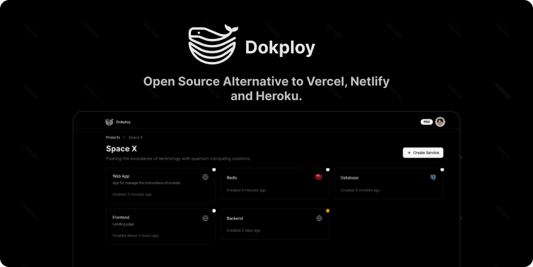

<div align="center">
   <div>
    <a href="https://dokploy.com" target="_blank" rel="noopener">
        
    </a>
</div>

</br>
<div align="center">
  <div>Join us on Discord for help, feedback, and discussions!</div>
  </br>
  <a href="https://discord.gg/2tBnJ3jDJc">
    
  </a>
</div>
</div>
<br />
Dokploy is a free self-hostable Platform as a Service (PaaS) that simplifies the deployment and management of applications and databases.

### Features

Dokploy include multiples features to make your life easier.

- **Applications**: Deploy any type of application (Node.js, PHP, Python, Go, Ruby, etc.).
- **Databases**: Create and manage databases with support for MySQL, PostgreSQL, MongoDB, MariaDB, Redis.
- **Backups**: Automate backups for databases to a external storage destination.
- **Docker Compose**: Native support for Docker Compose to manage complex applications.
- **Multi Node**: Scale applications to multiples nodes using docker swarm to manage the cluster.
- **Templates**: Deploy in a single click open source templates (Plausible, Pocketbase, Calcom, etc.).
- **Traefik Integration**: Automatically integrates with Traefik for routing and load balancing.
- **Real-time Monitoring**: Monitor CPU, memory, storage, and network usage, for every resource.
- **Docker Management**: Easily deploy and manage Docker containers.
- **CLI/API**: Manage your applications and databases using the command line or through the API.
- **Notifications**: Get notified when your deployments are successful or failed (Slack, Discord, Telegram, Email, etc.)
- **Multi Server**: Deploy and manager your applications remotely to external servers.
- **Self-Hosted**: Self-host Dokploy on your VPS.

## 🚀 Getting Started

To get started run the following command in a VPS:

```bash
curl -sSL https://dokploy.com/install.sh | sh
```

For detailed documentation, visit [docs.dokploy.com](https://docs.dokploy.com).

## Sponsors

🙏 We're deeply grateful to all our sponsors who make Dokploy possible! Your support helps cover the costs of hosting, testing, and developing new features.

[Dokploy Open Collective](https://opencollective.com/dokploy)

[Github Sponsors](https://github.com/sponsors/Siumauricio)

<!-- Hero Sponsors 🎖 -->

<!-- Add Hero Sponsors here -->

### Hero Sponsors 🎖

<div style="display: flex; align-items: center; gap: 20px;">
  <a href="https://www.hostinger.com/vps-hosting?ref=dokploy" target="_blank" style="display: inline-block;">
    
  </a>
  <a href="https://www.lxaer.com/?ref=dokploy" target="_blank" style="display: inline-block;">
    
  </a>
</div>

### Premium Supporters 🥇

<div style="display: flex; gap: 30px; flex-wrap: wrap;">
<a href="https://supafort.com/?ref=dokploy" target="_blank"></a>
</div>

<!-- Elite Contributors 🥈 -->

<!-- Add Elite Contributors here -->

### Supporting Members 🥉

<div style="display: flex; gap: 30px; flex-wrap: wrap;">
<a href="https://lightspeed.run/?ref=dokploy"></a>
<a href="https://cloudblast.io/?ref=dokploy "></a>
</div>

### Community Backers 🤝

<div style="display: flex; gap: 30px; flex-wrap: wrap;">
<a href="https://steamsets.com/?ref=dokploy"></a>
<a href="https://rivo.gg/?ref=dokploy"></a>
</div>

#### Organizations:

[](https://opencollective.com/dokploy)

#### Individuals:

[](https://opencollective.com/dokploy)

### Contributors 🤝

<a href="https://github.com/dokploy/dokploy/graphs/contributors">
  
  </a>

## Video Tutorial

<a href="https://youtu.be/mznYKPvhcfw">
  
</a>

<!-- ## Supported OS

- Ubuntu 24.04 LTS
- Ubuntu 23.10
- Ubuntu 22.04 LTS
- Ubuntu 20.04 LTS
- Ubuntu 18.04 LTS
- Debian 12
- Debian 11
- Fedora 40
- Centos 9
- Centos 8 -->

## Contributing

Check out the [Contributing Guide](CONTRIBUTING.md) for more information.
