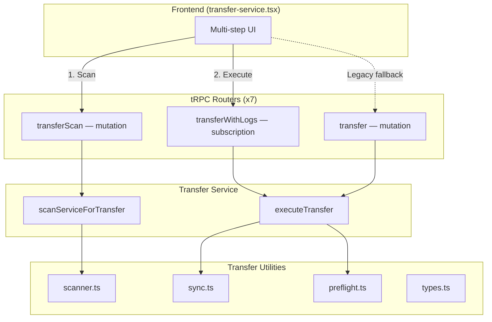
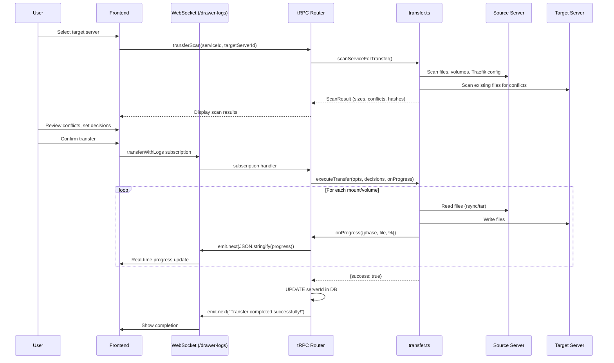

# RFC: Service Transfer Migration Between Servers

> **Status**: Draft — requesting maintainer feedback before finalizing PR  
> **Author**: Horsley  
> **Affected area**: Multi-server (remote server) service management  

## Scope

This feature applies to **multi-server mode** — where Dokploy manages multiple remote servers and users assign services to individual servers. 

> [!NOTE]
> **Not in scope: Docker Swarm mode.** Swarm has its own built-in mechanisms for service migration (node drain / service constraints). This feature targets the non-Swarm multi-server setup specifically.

## Problem Statement

When users need to **move a service from one remote server to another** (e.g., hardware migration, load balancing, server decommission), the current options are:

1. **For regular users**: Manually create a new service on the target server, re-enter all configurations (environment variables, domains, mounts, etc.), copy data files manually, then delete the old service. This is tedious, error-prone, and risks missing configurations or data.
2. **For advanced users**: SSH into both servers, manually `rsync` or `tar` the application directory and Docker volumes, then directly update `serverId` in the Dokploy database. This requires deep knowledge of Dokploy internals and is risky for database services whose volumes contain critical data.

Neither option provides any safety guarantees — there is no conflict detection, no progress feedback, and no rollback safety.

## Proposed Solution

A **two-phase transfer** feature that safely migrates services between remote servers:

1. **Scan phase**: Pre-flight analysis of source and target servers — detects files, sizes, and conflicts
2. **Execute phase**: Syncs files/volumes with real-time progress streaming, then atomically updates the `serverId` in the database

> [!IMPORTANT]  
> Source server data is **read-only** during transfer. Files are copied, never moved or deleted. The database `serverId` is updated only after a fully successful sync.

---

## Architecture Overview



### Data Flow



---

## What Gets Transferred

### Per Service Type

| Service Type | App/Compose Dir | Traefik Config | Auto Data Volume | User Mounts |
|:------------|:---------------:|:--------------:|:----------------:|:-----------:|
| Application  | ✅ | ✅ | — | ✅ |
| Compose      | ✅ | ✅ | — | ✅ |
| PostgreSQL   | — | — | ✅ `{appName}-data` | ✅ |
| MySQL        | — | — | ✅ `{appName}-data` | ✅ |
| MariaDB      | — | — | ✅ `{appName}-data` | ✅ |
| MongoDB      | — | — | ✅ `{appName}-data` | ✅ |
| Redis        | — | — | ✅ `{appName}-data` | ✅ |

### NOT Transferred

| Item | Reason |
|------|--------|
| TLS/SSL certificates | Each server manages its own Let's Encrypt certs |
| Docker images | Pulled from registry during deploy |
| Running containers | Only files/volumes are synced |
| Docker networks | Auto-created during deploy |
| Container logs | Ephemeral |

### Domain & TLS Cutover Guidance (Current Behavior)

For services that expose domains (typically Application / Compose), transfer currently moves Traefik dynamic routing config but **does not move ACME certificate storage (`acme.json`)**.

This means TLS certs are expected to be re-issued on the target server after cutover.

Recommended operator flow:

1. Complete transfer and deploy on target server
2. Update domain `A`/`AAAA` records to the target server IP
3. Wait for DNS propagation (TTL is an upper bound, not a strict global switch time)
4. Open the HTTPS domain to trigger certificate issuance on target Traefik
5. If issuance fails, retry after propagation; as fallback, redeploy the service or restart Traefik

---

## Service Downtime & Container State Management

Transferring a service involves copying files and Docker volumes between servers. To ensure data consistency, the service's containers should be **stopped before transfer**.

> [!WARNING]
> **Downtime is expected during transfer.** Users should plan for service unavailability from the moment the service is stopped until it is deployed on the target server.

### Pre-Transfer

| Step | Action | Reason |
|------|--------|--------|
| 1 | **Stop the service** on source server | Prevents data writes during file/volume copy, ensures consistency |
| 2 | Verify service is stopped | UI should confirm containers are not running |

> [!CAUTION]
> **For database services (PostgreSQL, MySQL, MariaDB, MongoDB, Redis)**: Writing to the database during volume transfer may result in **corrupted or inconsistent data** on the target. Always stop the database before transfer.

### Post-Transfer (Success)

| Step | Action | Reason |
|------|--------|--------|
| 1 | `serverId` is updated in DB | Service is now associated with the target server |
| 2 | **User must deploy/start** the service on the target server | Containers are not automatically started after transfer |
| 3 | Verify service is running correctly | Check logs, connectivity, data integrity |
| 4 | If domains are configured, update DNS `A`/`AAAA` to target and wait for propagation | ACME HTTP challenge must reach target Traefik |
| 5 | Trigger certificate issuance by visiting HTTPS domain (retry if needed) | Certificates are not migrated; target issues certs |
| 6 | (Optional) Clean up source server | Source files remain untouched; user can remove them when ready |

### Post-Transfer (Failure or Cancellation)

| Step | Action | Reason |
|------|--------|--------|
| 1 | `serverId` is **NOT** updated | Service remains associated with the source server |
| 2 | **User should restart the service** on the source server | Restore availability as quickly as possible |
| 3 | Investigate failure (check logs) | Common causes: SSH connectivity, disk space, permissions |
| 4 | Retry transfer when ready | Source data is unchanged, safe to retry |

> [!IMPORTANT]
> The UI should clearly indicate: (1) the service will experience downtime, (2) after success, a deploy is needed on the target, and (3) after failure, the user should restart the service on the source server.

### Downtime Timeline

```mermaid
gantt
    title Service Availability During Transfer
    dateFormat X
    axisFormat %s

    section Source Server
    Running           :done, 0, 1
    Stopped for transfer :crit, 1, 3
    Stopped (data still exists) :active, 3, 4

    section Target Server
    Empty             :done, 0, 2
    Receiving data    :active, 2, 3
    User deploys service :crit, 3, 4
    Running           :done, 4, 5

    section Downtime
    Service unavailable :crit, 1, 4
```



---

## Sync Methods

| Scenario | Method | Details |
|----------|--------|---------|
| Local → Remote | `rsync -az` over SSH | Efficient delta sync |
| Remote → Local | `rsync` + `tar` (by data type) | Service dir uses `rsync`; bind/volume file sync uses tar stream |
| Remote → Remote | `tar` pipeline via Dokploy server | `ssh source "tar czf -" \| ssh target "tar xzf -"` |
| Docker volume | Docker container + `tar` via SSH | Mounts volume read-only, streams via tar |

---

## Conflict Detection & Resolution

During the scan phase, files on both source and target are compared:

| Conflict Status | Meaning |
|----------------|---------|
| `missing_target` | File only exists on source (new file) |
| `newer_source` | Source file is newer than target |
| `newer_target` | Target file is newer than source |
| `conflict` | Both modified, different content |
| `match` | Identical files, no action needed |

For conflicts, the UI displays:
- File path
- File size
- Source vs target modification time
- Source vs target file hash (MD5)

Users choose per-file: **Overwrite** (replace target) or **Skip** (keep target).

---

## File Changes

### New Files

| File | Purpose |
|------|---------|
| `packages/server/src/services/transfer.ts` | Core orchestration — `scanServiceForTransfer()` and `executeTransfer()` |
| `packages/server/src/utils/transfer/scanner.ts` | File scanning for volumes (`docker run`) and bind mounts (`find`) |
| `packages/server/src/utils/transfer/sync.ts` | File-level sync with merge strategy support |
| `packages/server/src/utils/transfer/preflight.ts` | Pre-flight checks: path permissions, volume/directory creation |
| `packages/server/src/utils/transfer/types.ts` | Shared TypeScript types (`FileInfo`, `MountTransferConfig`, `TransferStatus`, etc.) |
| `packages/server/src/utils/transfer/index.ts` | Barrel export |
| `apps/dokploy/server/wss/data-transfer.ts` | Raw WebSocket server for granular transfer control (scan/compare/sync phases) |

### Modified Files

#### Router Endpoints (7 files)

Each router received two new endpoints and one enhanced endpoint:

| Router File | New: `transferScan` | New: `transferWithLogs` | Enhanced: `transfer` |
|:------------|:-------------------:|:-----------------------:|:--------------------:|
| `routers/application.ts` | ✅ | ✅ | ✅ |
| `routers/compose.ts` | ✅ | ✅ | ✅ |
| `routers/postgres.ts` | ✅ | ✅ | ✅ |
| `routers/mysql.ts` | ✅ | ✅ | ✅ |
| `routers/mariadb.ts` | ✅ | ✅ | ✅ |
| `routers/mongo.ts` | ✅ | ✅ | ✅ |
| `routers/redis.ts` | ✅ | ✅ | ✅ |

**Endpoint details:**

| Endpoint | Type | Purpose |
|----------|------|---------|
| `transferScan` | Mutation | Runs `scanServiceForTransfer()`, returns sizes/conflicts |
| `transferWithLogs` | Subscription | Runs `executeTransfer()` with real-time progress via `observable<string>`, updates `serverId` on success |
| `transfer` (enhanced) | Mutation | Same as above but synchronous (no streaming), kept as fallback |

> [!NOTE]
> The `transfer` mutation already existed in the codebase (it only updated `serverId`). We enhanced it to call `executeTransfer()` first, ensuring data is synced before the DB update.

#### Frontend

| File | Change |
|------|--------|
| `components/dashboard/shared/transfer-service.tsx` | Complete rewrite — multi-step flow with scan, conflict review, and real-time progress via tRPC subscription |

#### Server Infrastructure

| File | Change |
|------|--------|
| `packages/server/src/index.ts` | Added `transfer` service export |
| `apps/dokploy/server/server.ts` | Registered `setupDataTransferWebSocketServer` |

### Schema Updates (this PR)

| File | Change |
|------|--------|
| `db/schema/application.ts` | Added `apiTransferApplication` |
| `db/schema/compose.ts` | Added `apiTransferCompose` |
| `db/schema/postgres.ts` | Added `apiTransferPostgres` |
| `db/schema/mysql.ts` | Added `apiTransferMySql` |
| `db/schema/mariadb.ts` | Added `apiTransferMariaDB` |
| `db/schema/mongo.ts` | Added `apiTransferMongo` |
| `db/schema/redis.ts` | Added `apiTransferRedis` |

---

## Key Implementation Details

### `scanServiceForTransfer(opts)` → `TransferScanResult`

1. **Application/Compose directory**: Scans source and target with `scanBindMount()`, runs `compareFileLists()` to detect diffs
2. **Traefik config**: Reads `{appName}.yml` from both servers using existing `readConfig`/`readRemoteConfig` utilities
3. **All DB mounts**: Queries `findMountsByApplicationId(serviceId, serviceType)` to discover volumes and bind mounts, scans each on both sides
4. **Conflict hashing**: For conflicting files, computes MD5 hash on both sides for service directory, bind mounts, and Docker volumes via `computeFileHash()`
5. Returns total byte count, file lists, and per-file conflict details

### `executeTransfer(opts, decisions, onProgress)` → `{success, errors}`

1. **Service directory sync**: `rsync` (local↔remote) or `tar` pipeline (remote↔remote)  
2. **Traefik config sync**: Reads config from source, writes to target using existing Traefik utilities
3. **Pre-flight**: Creates target volumes (`docker volume create`) and directories (`mkdir -p`)
4. **Mount sync**: For each volume/bind, calls `syncMount()` from transfer utilities, respecting user decisions for conflicts
5. **Progress callback**: Reports `{phase, currentFile, processedFiles, totalFiles, transferredBytes, totalBytes, percentage}`

### `transferWithLogs` (tRPC Subscription)

Follows the exact pattern of the existing `deployWithLogs` across every router:

```typescript
transferWithLogs: protectedProcedure
  .input(apiTransferService.extend({
    decisions: z.record(z.enum(["skip", "overwrite"])).optional(),
  }))
  .subscription(async ({ input, ctx }) => {
    // auth check...
    return observable<string>((emit) => {
      executeTransfer(opts, decisions, (progress) => {
        emit.next(JSON.stringify(progress));
      }).then(async (result) => {
        if (result.success) {
          await db.update(table).set({ serverId: targetServerId })...
          emit.next("Transfer completed successfully!");
        } else {
          emit.next(`Transfer failed: ${result.errors.join(", ")}`);
        }
      });
    });
  }),
```

### Frontend Transfer Flow

```
Select Server → Scan → Review Conflicts → Confirm → Transfer (Live Logs) → Done
```

Each service type has its own wrapper component (e.g., `ApplicationTransfer`, `PostgresTransfer`) that calls the type-specific hooks at the top level, sharing common logic via `TransferInner`.

---

## Safety Guarantees

| Guarantee | How |
|-----------|-----|
| **Source is read-only** | All sync operations copy data; never delete/modify source |
| **Atomic DB update** | `serverId` updated only after `executeTransfer()` returns `success: true` |
| **Failure is safe** | On error, source remains unchanged; target may have partial files that can be cleaned up; retry is always possible |
| **User control** | Per-file conflict resolution (overwrite/skip) |
| **Auth enforced (tRPC)** | Organization membership + member-level `checkServiceAccess(..., "delete")` on `transferScan` / `transfer` / `transferWithLogs` |
| **Raw WS auth (`/data-transfer`)** | Session/login check only (service-level authorization still pending hardening) |

---

## UI User Flow

1. Navigate to **Service → Settings → Transfer Service**
2. Select target server from dropdown (remote servers + optional `Dokploy (Local)` target)
3. Click **Scan for Transfer** — shows loading while scanning both servers
4. Review scan results:
   - Total transfer size
   - Volume count
   - Conflict table with size, source/target mtime, hash, and overwrite/skip toggles
5. Click **Transfer** → confirmation dialog with:
   - Size estimate
   - ⚠️ **Downtime warning**: "Your service will be unavailable during transfer"
6. Watch real-time progress: progress bar, file count, bytes transferred, current file, scrollable log area
7. On **success**: 
   - ✅ "Transfer completed" message
   - Prompt: "Deploy the service on the target server to start it"
8. On **failure**:
   - ❌ Error message with details
   - Prompt: "Restart the service on the source server to restore availability"

---

## Discussion Points for Maintainer

1. **`data-transfer.ts` WebSocket server**: Raw WS endpoint `/data-transfer` supports scan/compare/sync and pause/resume/cancel. Current UI still uses tRPC subscription path, so WS remains an advanced/internal path.

2. **`transfer` mutation vs `transferWithLogs` subscription**: We kept both — the mutation as a synchronous fallback (e.g., for API/CLI usage) and the subscription for the UI. Is this acceptable, or should we consolidate?

3. **Auto-stop before transfer**: Should the system automatically stop the service before starting the transfer? This reduces user error but adds complexity. Current approach: user is responsible for stopping with a clear UI warning. Alternative: auto-stop and auto-restart on failure.

4. **Auto-deploy after transfer**: Should the system automatically deploy/start the service on the target after successful transfer? Current approach: user manually deploys. Alternative: auto-deploy, with rollback to source on failure.

5. **Rollback**: Currently, failed transfers leave partial data on the target but don't touch the source. Should we add explicit cleanup of target on failure?

6. **Schema ownership**: `apiTransfer*` schemas are now part of this feature scope and must stay aligned with router behavior (`targetServerId` + conflict decision payload contract).

---

## Limitations

1. **Service downtime is required** — service must be stopped on source before transfer; user deploys on target after
2. **No automatic rollback** — source is untouched, but target may have partial files on failure
3. **Network dependent** — large volumes take time on slow connections
4. **Same Dokploy instance** — both servers must be managed by the same Dokploy installation
5. **No incremental/resumable transfers** — if interrupted, the entire sync restarts
6. **Multi-server mode only** — does not apply to Docker Swarm mode (use Swarm drain instead)

---

## Testing Plan

- [x] TypeScript compilation: `pnpm --filter @dokploy/server exec tsc --noEmit` — 0 errors
- [ ] Manual: Transfer application between two servers
- [ ] Manual: Transfer database (PostgreSQL) with data volume between servers
- [ ] Manual: Transfer with file conflicts, verify overwrite/skip works
- [ ] Manual: Verify rollback safety — cancel mid-transfer, verify source unchanged
- [ ] Manual: Transfer remote→local (Dokploy server as target)
